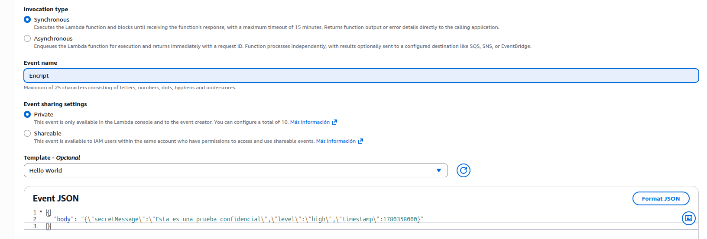
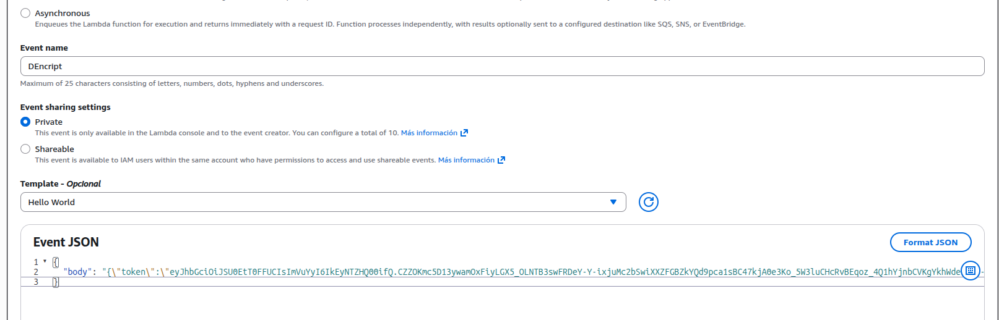
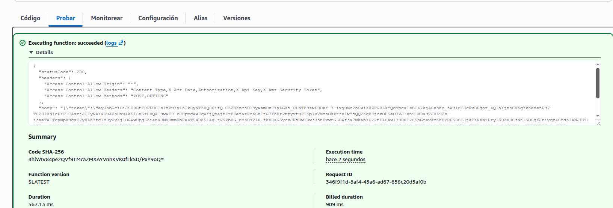
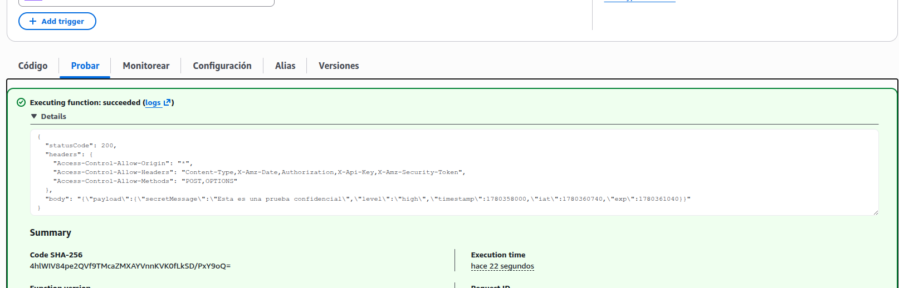

# 🔐 SDD Crypto Lambdas

Sistema serverless de encriptación/desencriptación usando JWT (RS256) + JWE (RSA-OAEP + A256GCM) desplegado en AWS Lambda con API Gateway.

## 🏗️ Arquitectura

```
┌─────────────┐
│   Client    │
└──────┬──────┘
       │
       ├─── POST /encrypt ───► Lambda Encrypt ──┐
       │                        │ Sign (RS256)  │
       │                        │ Encrypt JWE   │
       │                        └───────────────┘
       │                                ▼
       │                          ┌─────────────┐
       │                          │ JWE Token   │
       │                          └─────────────┘
       │                                │
       └─── POST /decrypt ───► Lambda Decrypt ◄─┘
                                │ Decrypt JWE
                                │ Verify JWT
                                └──────────────
                                       ▼
                                 ┌─────────┐
                                 │ Payload │
                                 └─────────┘
```

**Componentes:**

- **API Gateway**: REST API con CORS habilitado
- **Lambda Encrypt**: Firma JWT con RS256 y encripta como JWE
- **Lambda Decrypt**: Desencripta JWE y verifica firma JWT
- **AWS Secrets Manager**: Almacena claves RSA (privada/pública)
- **CloudFormation**: Gestión de infraestructura como código

## 📋 Requisitos

- **Node.js**: v18 o superior
- **AWS CLI**: v2 configurado con credenciales
- **AWS SAM CLI**: v1.100 o superior
- **Cuenta AWS**: con permisos para Lambda, API Gateway, Secrets Manager, CloudFormation

## 🚀 Instalación

### 1. Clonar repositorio

```bash
git clone <repository-url>
cd sdd-crypto-lambdas
npm install
```

### 2. Configurar variables de entorno

```bash
cp .env.example .env
# Editar .env con tus ARNs de Secrets Manager
```

### 3. Crear claves RSA en AWS Secrets Manager

```bash
# Generar par de claves RSA
openssl genrsa -out private.pem 2048
openssl rsa -in private.pem -pubout -out public.pem

# Crear secretos en AWS
aws secretsmanager create-secret \
  --name sdd-crypto/private-key \
  --secret-string file://private.pem \
  --region us-east-1

aws secretsmanager create-secret \
  --name sdd-crypto/public-key \
  --secret-string file://public.pem \
  --region us-east-1

# Eliminar archivos locales (ya están en Secrets Manager)
rm private.pem public.pem
```

### 4. Actualizar template con ARNs

Edita `sam/template.yaml` y actualiza los parámetros `PrivateKeySecretArn` y `PublicKeySecretArn` con los ARNs obtenidos.

### 5. Desplegar stack SAM

```bash
# Primera vez (modo guiado)
sam build
sam deploy --guided

# Siguientes despliegues
sam build && sam deploy
```

## 🧪 Testing

### Tests unitarios e integración

```bash
# Todos los tests
npm test

# Solo tests de integración
npm run test:flow

# Watch mode
npm run test:watch
```

### Pruebas en AWS Console

#### 1. Prueba de Lambda Encrypt

Desde la consola de AWS Lambda, selecciona la función `EncryptFunction` y usa el siguiente evento de prueba:

```json
{
  "body": "{\"data\":\"test value\",\"user\":\"admin\"}",
  "headers": {
    "Content-Type": "application/json"
  },
  "httpMethod": "POST"
}
```



#### 2. Prueba de Lambda Decrypt

Usando el token obtenido del paso anterior, prueba la función `DecryptFunction`:

```json
{
  "body": "{\"token\":\"eyJhbGciOiJSU0EtT0FFUCIsImVuYyI6IkEyNTZHQ00ifQ...\"}",
  "headers": {
    "Content-Type": "application/json"
  },
  "httpMethod": "POST"
}
```



#### 3. Logs en CloudWatch

Verifica los logs de ejecución en CloudWatch para debugging y monitoreo:



#### 4. Métricas de rendimiento

Revisa las métricas de invocaciones, duración y errores en CloudWatch:



### Prueba con frontend

Abre `test-frontend.html` en tu navegador para una interfaz visual de prueba.

```bash
# Linux/WSL
xdg-open test-frontend.html

# macOS
open test-frontend.html
```

### Prueba con cURL

```bash
# Encrypt
curl -X POST https://YOUR_API_URL/dev/encrypt \
  -H "Content-Type: application/json" \
  -d '{"data":"test","user":"demo"}'

# Respuesta: {"token":"eyJhbGc..."}

# Decrypt
curl -X POST https://YOUR_API_URL/dev/decrypt \
  -H "Content-Type: application/json" \
  -d '{"token":"eyJhbGc..."}'

# Respuesta: {"payload":{"data":"test","user":"demo","iat":...,"exp":...}}
```

## 📁 Estructura del proyecto

```
sdd-crypto-lambdas/
├── lambdas/
│   ├── encrypt/
│   │   └── handler.js          # Lambda encrypt endpoint
│   ├── decrypt/
│   │   └── handler.js          # Lambda decrypt endpoint
│   └── shared/
│       └── crypto.js           # Lógica de firma/cifrado compartida
├── sam/
│   └── template.yaml           # CloudFormation SAM template
├── tests/
│   ├── encrypt.handler.test.js
│   ├── decrypt.handler.test.js
│   └── flow.integration.test.js
├── test-frontend.html          # UI de prueba interactiva
├── package.json
├── jest.config.js
├── .env.example
├── .gitignore
└── README.md
```

## 🔧 Configuración SAM

El stack despliega:

- **API Gateway REST API** con CORS habilitado
- **2 funciones Lambda** (EncryptFunction, DecryptFunction)
- **IAM Roles** con permisos para Secrets Manager
- **CloudWatch Logs** para debugging

### Parámetros configurables

- `StageName`: Nombre del stage de API Gateway (default: `dev`)
- `PrivateKeySecretArn`: ARN del secreto con la clave privada
- `PublicKeySecretArn`: ARN del secreto con la clave pública

## 📊 Monitoreo

### Ver logs en tiempo real

```bash
# Logs de encrypt
sam logs -n EncryptFunction --tail

# Logs de decrypt
sam logs -n DecryptFunction --tail
```

### Métricas en CloudWatch

- **Invocaciones**: Número de ejecuciones
- **Duración**: Tiempo de ejecución promedio
- **Errores**: Tasa de errores
- **Throttles**: Peticiones limitadas

## 🔒 Seguridad

### Buenas prácticas implementadas

✅ **Claves en Secrets Manager**: No hay claves hardcodeadas
✅ **IAM Least Privilege**: Solo permisos necesarios
✅ **JWT con expiración**: Tokens expiran en 5 minutos
✅ **Algoritmos robustos**: RS256 para firma, RSA-OAEP + A256GCM para cifrado
✅ **CORS configurado**: Solo métodos y headers permitidos

### Recomendaciones adicionales

- [ ] Implementar autenticación en API Gateway (API Key, Cognito, Lambda Authorizer)
- [ ] Habilitar AWS WAF para protección DDoS
- [ ] Configurar rate limiting por IP
- [ ] Rotar claves RSA periódicamente
- [ ] Habilitar CloudTrail para auditoría

## 🔄 Flujo de datos

### Encrypt

1. Cliente envía payload JSON: `{"data": "value"}`
2. Lambda obtiene claves desde Secrets Manager
3. Genera JWT firmado con RS256 (incluye `iat`, `exp`)
4. Encripta JWT como JWE usando RSA-OAEP + A256GCM
5. Retorna token: `eyJhbGciOiJSU0EtT0FFUCIsImVuYyI6IkEyNTZHQ00ifQ...`

### Decrypt

1. Cliente envía token JWE: `{"token": "eyJhbG..."}`
2. Lambda obtiene claves desde Secrets Manager
3. Desencripta JWE usando clave privada
4. Verifica firma JWT con clave pública
5. Retorna payload original con metadatos: `{"payload": {...}}`

## 🛠️ Comandos útiles

```bash
# Validar template SAM
sam validate --template sam/template.yaml

# Invocar localmente
sam local invoke EncryptFunction -e events/encrypt-event.json

# Sincronización rápida (hot reload)
sam sync --stack-name sdd-crypto-lambdas --watch

# Eliminar stack
sam delete --stack-name sdd-crypto-lambdas
```

## 📝 Dependencias principales

- **jose** (v4.15.5): JWT/JWE operations
- **@aws-sdk/client-secrets-manager** (v3.529.0): AWS Secrets Manager SDK
- **jest** (v29.7.0): Testing framework

## 🐛 Troubleshooting

### Error: ECONNREFUSED 127.0.0.1:2773

**Causa**: Lambda intenta usar la extensión local de Secrets Manager.  
**Solución**: Verifica que uses `@aws-sdk/client-secrets-manager` en lugar de `fetch()` local.

### Error: CORS policy blocked

**Causa**: Headers CORS no configurados.  
**Solución**: Verifica que el template tenga la sección `Cors` en `CryptoApi` y que los handlers retornen `CORS_HEADERS`.

### Error: Encryption/Decryption failed

**Causa**: Claves incorrectas o ARNs inválidos.  
**Solución**: Verifica los ARNs en Secrets Manager y que las claves sean válidas PEM RSA 2048.

## 📄 Licencia

[Especifica tu licencia aquí]

## 👥 Contribución

[Instrucciones de contribución]

---

**Desarrollado con ❤️ usando AWS SAM + Node.js**
